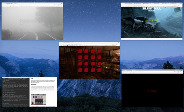

# Silent Hill Memory

## Concept
Silent Hill Memory is a memory game based on famous survival horror franchise "Silent Hill". The franchise came out with its frist game back in 1998 and impressed the gamers world-wide with its extremely dark environments, incredibly original and deep storyline, psychological thrills, and advanced graphics, which were pushing consoles' graphics at that time to the fullest.

## Rules

In this game, you are presented with a grid of 16 cells. Behind each cell is a picture of a character revealed to you for 4 seconds and then hidden. You have to memorize the location of all the characters, and "save" them by selecting the appropriate cells. If you select all the characters and fill the upper bar with them, you win.

The cells however are mixed with images of monsters - you have to memorize where the human characters are and monster characters. If you click on a cell with a monster - you loose and get a genuine jump-scare, that might make you scream and curse real loud.
All the monsters have reddish background in their images, so it makes them a bit easier to spot. Yet, the main monster (Pyramid Head) does not have a background, making it a bit harder to identify him. If you select his cell by mistake...oh boy!
It also uses to the fullest the technique of randomization. 

## Technologies used
### Pages
Silent Hill Memory in the spirit of real SH games, pushes the limits of HTML and CSS to its fullest, by storing many pages on top of each other with opacity 0 and pointer-events: none with position fixed, in order to have smooth and sudden transitions between each window, while being on the same page.

### Randomization
There is lots of randomization happening for many elements in the game. Title page music, Game page music, Game page background, Monster page background, Title page music after getting Bad Ending, and of course the images of characters placed inside the cells are all randomized.
The way it is achieved is by storing the data of images and audio in arrays, and choosing an element of that array with a randomizer function. There is also a function that shuffles an array that stores all the characters.
### Audio

To stay true to the original game series, all the audio in the game is made out of the original music of the series composed by Akira Yamaoka, including the music and sound effects. The original compositions and sound effects were specifically prepared and cut to fit the timing and looping functions of the game.
### Video
While regular monsters carry CSS animation, there are some special video  cutscenes included for higher level monstocities, and who knows...maybe even a special secret ending??

## A word to the player
We suggest you embark on your memory practice equipped with good headphones and audio on. The jumpscares WILL GET YOU! Why shouldn't they?? They are best with audio and work real well with it.
Try not to play this game in front of kids, girlfriend who is easily scared, or parents, as you might psychologically damage your close ones with sounds not eminating only from the game but as well from your mouth when you scream after your mouse clicks on a lovely monster cell, which is patiently waiting for your delicious self. :)

## ...secrets?
Silent Hill franchise with its mastermind Hideo Kojima was also known for lots of secrets within the game, including special endings and unlockable features. There is a possibility of this game containing an extreme difficulty level. See if you can figure out how to unlock it after beating the game in regular mode.
